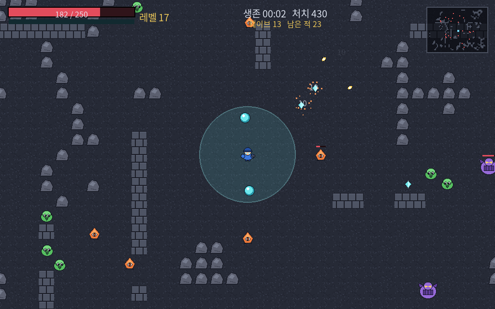
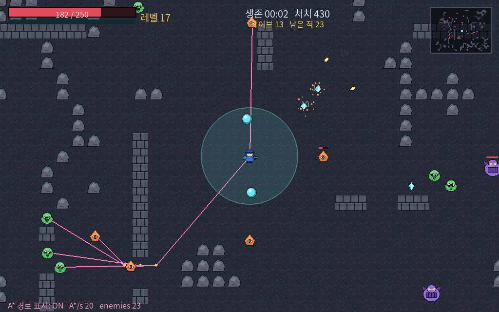
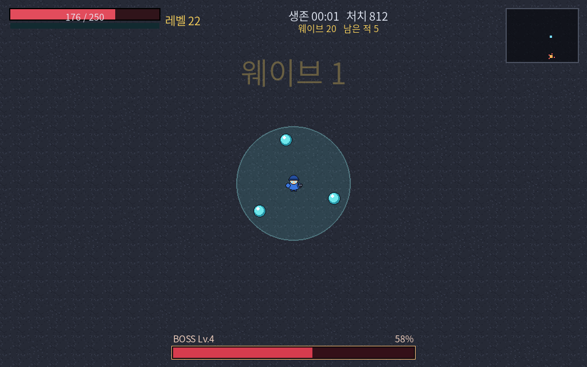

# A-star Survivors

파이썬 + pygame으로 만든 뱀서라이크(vampire-survivors-like) 웨이브 디펜스 게임.

적의 이동에 **A\* 최단경로 탐색**이 들어가 있고, **이미지와 효과음을 전부 코드로 생성**한다.
외부 리소스 파일이 하나도 없어서 저장소가 가볍고, 색·음색을 상수만 바꿔 통째로 바꿀 수 있다.



---

## 실행

```bash
pip install -r requirements.txt
python game.py
```

윈도우라면 `run.bat`을 더블클릭해도 된다. 파이썬을 찾아 주고, 필요한 라이브러리가
없으면 자동으로 설치한 뒤 실행한다.

첫 실행 때 `assets/` 폴더에 스프라이트 13개와 효과음 18개를 만들어 저장한다(약 1초).
다시 만들려면 `python gen_assets.py`, `python gen_sounds.py`.

| 키 | 기능 |
|---|---|
| `WASD` / 방향키 | 이동 (공격은 자동) |
| `1` `2` `3` | 레벨업 강화 선택 |
| `M` | 음소거 |
| **`F1`** | **A\* 경로 실시간 표시** |
| `F11` / `Alt+Enter` | 전체화면 |
| `ESC` / `P` | 일시정지 |
| `R` / `H` | 재시작 / 타이틀로 |

한글 폰트(맑은 고딕, 나눔고딕, Noto CJK 등)가 있으면 한국어로, 없으면 자동으로 영어로 표시된다.
`assets/ramche.ttf` 같은 폰트 파일을 넣어 두면 시스템 폰트보다 우선해서 쓴다.

---

## 게임 규칙

- 한 웨이브의 적을 **전부 처치해야** 다음 웨이브가 시작된다.
- 5웨이브마다 보스가 등장한다. 보스는 나올 때마다 단계가 올라 강해지고, 쓰는 패턴이 늘어난다.
- **보스전에는 지형이 사라져 열린 투기장이 된다.** 보스를 잡으면 다시 돌아온다.
- **30웨이브(보스전 6회) 클리어가 승리 조건.**
- 난이도 4단계. 플레이어 체력, 요구 경험치, 적의 체력·속도·공격력이 함께 바뀐다.

---

## 파일 구조

| 파일 | 내용 |
|---|---|
| `game.py` | 게임 루프, 적 AI, 보스, 무기, 웨이브, 렌더링 |
| `pathfinding.py` | Grid, A\*, DDA 가시선 판정, string pulling, flow field |
| `gen_assets.py` | Pillow로 스프라이트·타일 13종을 그려 PNG로 저장 |
| `gen_sounds.py` | numpy로 효과음 18종의 파형을 합성해 WAV로 저장 |
| `run.bat` / `diagnose.bat` | 윈도우용 실행 / 문제 진단 스크립트 |

---

## 알고리즘 / 수학

### 1. 왜 A\*가 필요한가

맵에 벽과 바위가 있어서 적이 플레이어를 향해 직선으로 오면 **막힌다.**
"길찾기를 넣기 위해 억지로 만든 상황"이 아니라, 지형이 있으면 필연적으로
"어디로 돌아가야 가장 빠른가"를 풀어야 한다.

월드를 64×48 타일 그래프 $G=(V,E)$로 보고, 8방향 이동에 직선 비용 1, 대각선 비용 $\sqrt2$를 준다.

$$f(n) = g(n) + h(n)$$

### 2. 휴리스틱: 옥타일 거리

$$h(n) = (dx + dy) + (\sqrt2 - 2)\min(dx, dy)$$

**유도:** 장애물이 없으면 대각선으로 $\min(dx,dy)$번, 직선으로 $|dx-dy|$번 움직이는 게 최적이므로
최단거리는 $\sqrt2\min(dx,dy) + (\max-\min)$이고, 정리하면 위 식이 된다.

- **허용적(admissible):** 장애물이 생기면 실제 비용은 늘어나기만 하므로 $h(n) \le h^*(n)$.
  따라서 A\*가 찾은 경로는 **최단경로임이 보장된다.**
- **일관적(consistent):** $h(n) \le c(n,n') + h(n')$. 닫힌 목록에 들어간 노드를 다시 열 필요가
  없어 구현이 단순해지고, 이진 힙을 쓰면 $O(|E|\log|V|)$로 묶인다.

> 맨해튼 거리 $dx+dy$는 대각선 이동을 과대평가해 **허용성이 깨진다.** 8방향에서는 옥타일이 맞다.

### 3. 가시선 판정 — DDA 격자 순회

적은 대부분 플레이어가 그냥 보이는 위치에 있다. 그때는 A\*를 돌릴 필요 없이 직진하면 된다.
매 프레임 "벽이 가로막고 있는가"를 판정하는데, 이게 원래 가장 무거운 부분이었다.

선분을 표본화해 검사하면 길이에 비례해 계산량이 커지고 얇은 벽을 놓칠 수 있다.
**DDA(Amanatides & Woo)** 는 "다음 세로선까지의 거리"와 "다음 가로선까지의 거리"를 비교해
가까운 쪽으로 한 칸씩 전진하므로, 선분이 **실제로 지나는 타일 수**만큼만 검사하고 누락도 없다.

### 4. 몸집을 고려한 경로 — clearance

탱커·보스는 좁은 통로에 물리적으로 들어가지 못한다. 모든 벽 타일에서 동시에 BFS를 돌려
(거리 변환) 각 칸이 벽에서 몇 칸 떨어졌는지 미리 계산해 두고, A\*가 몸집이 안 들어가는 칸을
후보에서 제외한다. 넓은 길이 아예 없으면 요구 폭을 낮춰 재시도한다.

여기에 더해 **맵 생성 단계에서 폭 1칸 통로를 없앤다.** 빈 칸 하나하나가 "전부 빈칸인 2×2 블록"에
최소 하나는 속하도록, 벽을 가장 적게 허물어도 되는 쪽을 골라 뚫는다.

### 5. string pulling — 경로 직선화

A\*가 준 경로는 타일 중심을 잇는 계단 모양이다. 삼각부등식 $|AC| \le |AB| + |BC|$ 을 이용해
**A에서 C가 직접 보이면 중간점 B를 지운다.** 경로 길이는 단조 감소하고 움직임이 자연스러워진다.
`F1`로 켜 보면 경로가 벽 모서리에서만 꺾이는 걸 볼 수 있다.



### 6. 다익스트라 flow field

A\*는 적 한 마리당 한 번씩 돌아야 하지만 목표(플레이어)는 모두 같다. 플레이어 한 점에서
출발하는 다익스트라를 한 번만 돌리면 전 타일의 "가야 할 방향"을 뽑아 공유할 수 있다.
(A\*는 휴리스틱이 있는 다익스트라이고, $h \equiv 0$이면 둘은 같아진다.)

다만 모두가 같은 길로 몰려 움직임이 단조로워지므로, **A\*를 기본으로 쓰고 프레임당 호출
예산(8회)이 바닥났을 때만** flow field를 쓰는 하이브리드 구조를 택했다.

### 7. 보스의 요격 예측

보스는 플레이어의 *현재* 위치가 아니라 *갈* 위치를 노린다. 쫓는 쪽이 $t$초에 갈 수 있는 거리
$s\,t$와 목표의 위치 $P + v t$가 같아지는 조건을 세우면 $t$에 대한 이차방정식이 된다.

$$(v\cdot v - s^2)\,t^2 + 2\,v\cdot(P-B)\,t + |P-B|^2 = 0$$

양수 해 중 최소값이 가장 빨리 만나는 시각. 이걸로 **도주 방향을 가로막는** 움직임이 나온다.
보스는 거리를 재는 상태 기계로 움직인다 — 멀면 요격점으로 접근, 가까우면 후퇴, 중간이면 선회.



### 8. 그 외

- **분리 조향(separation):** 반경 안의 다른 적에 대해 $\sum (\mathbf{p}_i - \mathbf{p}_j)/|\mathbf{p}_i - \mathbf{p}_j|$ 로 밀어낸다. 참조 이웃은 8마리로 끊는다.
- **공간 해시:** 48px 격자 셀로 나눠 담아 충돌 판정을 $O(n^2)$에서 기대 $O(n)$으로.
- **스폰 분포:** $\theta \sim U[0,2\pi)$ 로 플레이어 중심 원 위에 균등 배치.
- **난이도 곡선:** 강화가 곱연산이라 플레이어 화력은 복리로 커진다. 적 체력도 복리 $(1.065)^{wave-1}$ 로 맞춰야 후반이 쉬워지지 않는다. 반면 공격력은 선형으로만 올린다(즉사 방지).

---

## 리소스 생성

### 이미지 — Pillow

`gen_assets.py`가 도형을 겹쳐 32~48px 픽셀아트를 그린다. PIL은 안티에일리어싱을 하지 않아
경계가 딱 떨어지므로 도트 느낌이 자연스럽게 나온다.

### 효과음 — numpy 합성

소리는 결국 시간에 대한 진폭 배열이다. 사인파는 맑은 음, 노이즈는 타격·폭발음의 재료가 된다.

- **총성**: 음정이 있으면 레이저처럼 들린다. 고역 노이즈(파열음) + 중역 노이즈(몸통) + 90Hz 사인(반동)을 겹쳐 만든다. 에너지의 93%가 첫 5ms에 몰린다.
- **사각파를 직접 샘플링하면** 배음이 나이퀴스트를 넘겨 되접히는 앨리어싱 잡음이 생긴다.
- 모든 음의 포락선이 0에서 시작해 0으로 끝나야 '틱' 하는 클릭이 안 생긴다.

---

## 성능

적 200마리 기준으로 프로파일링하며 다듬은 기록.

| 항목 | 개선 전 | 개선 후 |
|---|---|---|
| update 1프레임 | 18.6 ms | **5.6 ms** |
| flow field 재계산 | 35 ms | **8.2 ms** |
| 최악 프레임(장시간 플레이) | 67.7 ms | **~19 ms** |

1. 가시선 판정을 표본화 → DDA 격자 순회 (전체 시간의 65%를 먹던 병목)
2. 가시선을 0.1초 간격으로만 갱신하고 캐싱 (재계산 시점을 개체마다 흩뿌려 특정 프레임에 몰리지 않게)
3. flow field를 딕셔너리 → 평면 배열, 직전에 건드린 칸만 초기화
4. A\* 노드 전개 상한 + 프레임당 호출 예산
5. 분리 조향의 참조 이웃 수 제한 (적이 뭉치면 비용이 제곱으로 튀던 문제)

---

## 밸런스 조정

숫자는 전부 `game.py` 상단 상수 블록에 모여 있다. 로직을 건드리지 않고 조정할 수 있다.

```python
ENEMY_CAP            # 동시에 존재 가능한 최대 적 수
WAVE_BASE_ENEMIES    # 1웨이브 몬스터 수
WAVE_ENEMY_GROWTH    # 웨이브마다 추가되는 수
WAVE_HP_GROWTH       # 적 체력 복리 증가율  ← 후반 난이도를 가장 크게 좌우
WAVE_DMG_GROWTH      # 적 공격력 선형 증가율
BOSS_EVERY           # 몇 웨이브마다 보스인가
WIN_WAVE             # 승리 조건
BOSS_HP_GROWTH / BOSS_HP_EXP   # 보스 단계별 체력
SPAWN_TABLE          # 몬스터 종류별 등장 가중치와 '위협도 비용'
SFX_VOLUME / SFX_TABLE         # 음량과 소리별 최소 재생 간격
```

`WAVE_HP_GROWTH`는 복리라서 0.005만 바꿔도 후반이 크게 움직인다.

---

## 더 해볼 것

- **JPS(Jump Point Search)**: 균일 격자에서 A\*의 대칭 경로를 건너뛴다. A\*와 탐색 노드 수를 비교해 보면 좋다.
- 경로 재사용: 비슷한 위치의 적들이 하나의 경로를 공유하도록 묶기
- 벽을 부수는 적 → 지형이 바뀌므로 경로를 언제 다시 계산할지가 문제가 된다
- 강화 풀을 다 쓰면(약 58레벨) 플레이어가 더 강해지지 않는다. 반복 가능한 소형 강화 추가
- 무기 진화, 저장/랭킹

---

## 참고 문헌

- Hart, Nilsson, Raphael (1968), *A Formal Basis for the Heuristic Determination of Minimum Cost Paths*
- Amanatides & Woo (1987), *A Fast Voxel Traversal Algorithm for Ray Tracing*
- Reynolds (1987), *Flocks, Herds, and Schools: A Distributed Behavioral Model*

## 라이선스

MIT License — `LICENSE` 참고.
